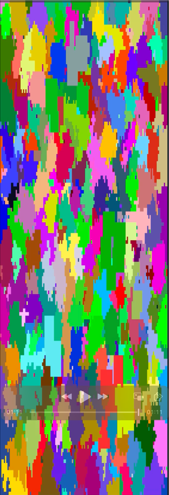
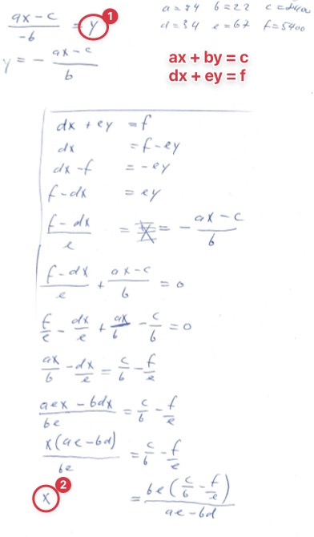
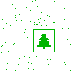

# Advent of Code 2024

Welcome to AoC 2024! Another year, another try! but remember, Program Or Die! Muahahahahaaa!

Eagerly, we're all awaiting [Advent of Code, Edition 2024!](https://adventofcode.com/2024/). Finally, it's here.
What a magical time of the year!

My AoC 2024 solutions in GO, again.

## Run problems

All problems can be run by its day index, e.g:

```
$ go run 01
```

or all together:

```
$ go run
```

## Define Problems

1) Create a struct in the `problems` package that implements the `Problem` interface, e.g.:

```go
package problems

import (
	"fmt"
	"alexi.ch/aoc/2024/lib"
)

type DayXX struct {
	s1 uint64
	s2 uint64
}

func NewDayXX() DayXX {
	return DayXX{s1: 0, s2: 0}
}

func (d *DayXX) Title() string {
	return "Day XX - Title comes here"
}

func (d *DayXX) Setup() {
	// var lines = lib.ReadLines("data/01-test.txt")
	var lines = lib.ReadLines("data/01-data.txt")
	for _, line := range lines {
		line = line
	}
	// fmt.Printf("%v\n", d.numbers)
}

func (d *DayXX) SolveProblem1() {
	d.s1 = 0
}

func (d *DayXX) SolveProblem2() {
	d.s2 = 0
}

func (d *DayXX) Solution1() string {
	return fmt.Sprintf("%d", d.s1)
}

func (d *DayXX) Solution2() string {
	return fmt.Sprintf("%d", d.s2)
}
```

2) import and instantiate the struct in the main program `aoc.go`:

```go
// aoc.go
var dayXX = problems.NewDayXX()
problem_map["XX"] = &dayXX
```


## Some Notes to certain days

### Day 12: Flood-Fill vizualization

Day 12 was a flood-fill problem. I visualized the areas to fill:



### Day 13: Linear Equation

I realized that the problem can be solved using a Linear Equation:

Press A x times, B y times moves the arm to the Target X/Y: This means we have a linear system as follows:

We reach X by pressing x*A + y*B = X (moves the X-axis x*AX plus y*BX)
We reach Y by pressing x*A + y*B = Y (moves the Y-axis x*AY plus y*BY)

so our movements to reach X and Y can be expressed as:

x*AX + y*BX = Prize X
x*AY + y*BY = Prize Y

I used a substitution approach by using some old-school math substitution:

so we can solve this with a linear system solving approach to find.
Let's rename the variables a bit to make it simpler:

ax + by = c  (a = Ax, b = Bx, c = Prize X)
dx + ey = f  (d = Ay, e = By, f = Prize Y)

I'm using a subsitution approach: separate y, then replace y in the other formula:
y = -(a*x - c)/b
x = (b*e*(c/b-f/e))/(a*e-b*d)
So we can first calculate x without any dependency to y, then insert x to the y formula.
Example:

Input:
Button A: X+94, Y+34
Button B: X+22, Y+67
Prize: X=8400, Y=5400

a = 94, b = 22, c = 8400
d = 34, e = 67, f = 5400
--> x = (22*67*(8400/22-5400/67))/(94*67-22*34) = 80

y = -(94*80 - 8400) / 22 = 40

As soon as x and y resolve to a whole number (the number of A-triggers (x) and the number of B-trigger (y)), we found a solution.

This was grea fun, as I could use some old-school math again, and I still got it :-)

My paper approach: 


### Day 14: Find the tree!

The idea was to find a specific arrangement of pixels after an unknown round of
modifications, here, we were looking for a Christmas Tree!

My first idea was to just output the image after each round, and check them visually, maybe there will be a
pattern in the pixel movement?

After viewing some hundred ascii art images manually, I gave up: The pixels did just jump around randomly, and
did not form anything useful.

My second idea was that the tree must be in the center: The first problem indicated that the 
center lines were important - so I looked for a long center arrangement of the pixels - and could
not find any image whithin millions of rounds. So that was not it.

So I did it the hard way: I generated real images (pngs) for the first 10'000 rounds, and viewed them
im the MacOS finder in a grid - and voilà, there it was! deeply buried in some 1000's of images....
And of course it was NOT a big tree in the center....

So after I know how the tree must look, I could find it programmatically.

Here it is:



That was a fun one!


### Day 15 - Move the boxes!

A nice robot movement puzzle, with a twist in the 2nd part (boxes to move grow 2 cells wide....)

After some fiddling I got it right, and did a nice anination using [tcell](https://github.com/gdamore/tcell/), too:

